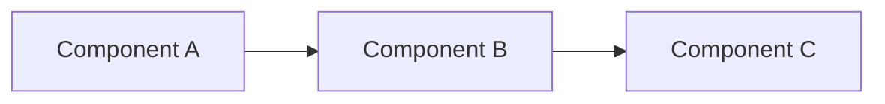
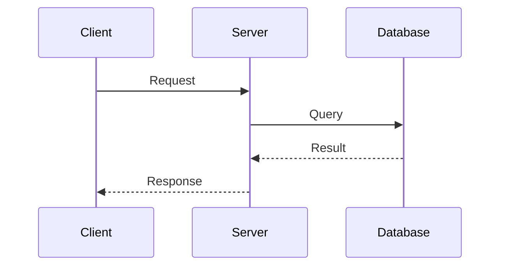

# Design: {Feature Name}

## Overview

{High-level summary: what this design does, why this approach was chosen, and how it fits into the existing system.}

## Key Design Decisions

| Decision | Rationale | Rejected Alternative |
|----------|-----------|----------------------|
| {Decision} | {Why this approach} | {What was considered and why it lost} |

## Architecture

{Describe the high-level architecture — major components and their relationships. Include a Mermaid, ASCII, or HTML diagram showing the component topology.}

## Components

### {Component Name}

- **Purpose:** {What this component does}
- **Responsibilities:** {Key behaviors it owns}
- **Interfaces:** {What it exposes and consumes}
- **Dependencies:** {Other components or external systems it relies on}

### {Component Name}

- **Purpose:** {What this component does}
- **Responsibilities:** {Key behaviors it owns}
- **Interfaces:** {What it exposes and consumes}
- **Dependencies:** {Other components or external systems it relies on}

## Data Flow

{Describe how data moves through the system for the key user-facing operations. Include a Mermaid sequence diagram or ASCII flow showing the critical path.}

## Testing Strategy

{What levels of testing are needed, key scenarios to cover, and any testing infrastructure or patterns required.}

## Future Work

{Ideas or improvements deferred from this design. Keeps them visible without cluttering the current scope.}
